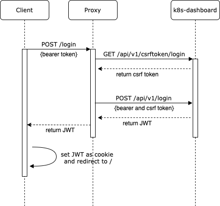

# kubernetes-dashboard-iam-proxy

The aim of this project is to provide an in-browser version of `aws eks get-token` to enable [cluster authentication using IAM](https://docs.aws.amazon.com/eks/latest/userguide/managing-auth.html) for the [Kubernetes dashboard](https://github.com/kubernetes/dashboard).

**suggested login flow**

