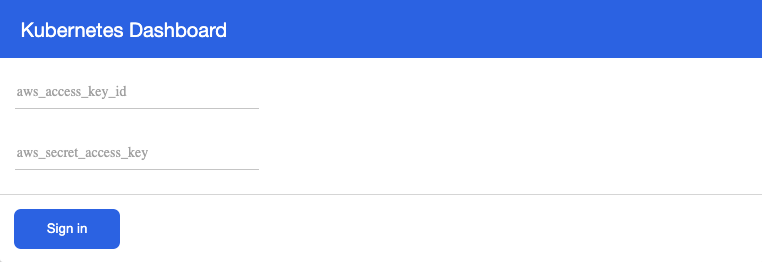

# kubernetes-dashboard-iam-proxy

#### An in-browser version of `aws eks get-token` to enable [cluster authentication using IAM](https://docs.aws.amazon.com/eks/latest/userguide/managing-auth.html) for the [Kubernetes dashboard](https://github.com/kubernetes/dashboard).





## Run it on your local machine ...

1. First you need to expose some environment variables to the application :
```
export UPSTREAM_DASHBOARD_URL=<endpoint for the Kubernetes dashboard>
export PROXY_PORT=8888
export PROXY_URL=http://localhost
export CLUSTER_NAME=<cluster name>
```
2. Install dependencies and start the app :
```
npm install and npm start
```

## ... or in a cluster

Helm chart to be released on Helm hub soon.

## Release History
* 0.1.0
    * Initial release

## Contributing

1. Fork it
2. Create your feature branch
3. Commit your changes
4. Push to the branch
5. Create a new Pull Request
