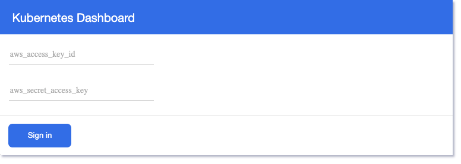

# kubernetes-dashboard-iam-proxy

#### An in-browser version of `aws eks get-token` to enable [cluster authentication using IAM](https://docs.aws.amazon.com/eks/latest/userguide/managing-auth.html) for the [Kubernetes dashboard](https://github.com/kubernetes/dashboard).





## Run it on your local machine ...

1. The proxy needs to be able to reach the Kubernetes dashboard. One way to do that is to proxy
the Kubernetes API to localhost [as per the documentation](https://github.com/kubernetes/dashboard#access).
Make sure you can reach the Kubernetes Dashboard from your browser.
2. Next, expose some environment variables to the application :
```
export UPSTREAM_DASHBOARD_URL=<endpoint for the Kubernetes dashboard (see step one)>
export PROXY_PORT=8888
export PROXY_URL=http://localhost
export CLUSTER_NAME=<the name of your kubernetes cluster>
```
2. Install dependencies and start the app :
```
npm install and npm start
```

## ... or in a cluster

A helm chart is available in the helm-chart folder. It will require some customization such as managing ingress traffic to the proxy

## Release History
* 0.1.0
    * Initial release

## Contributing

Contributions are welcome in the form of pull requests. Feel free to open an issue if you run into any problems while using this project.
